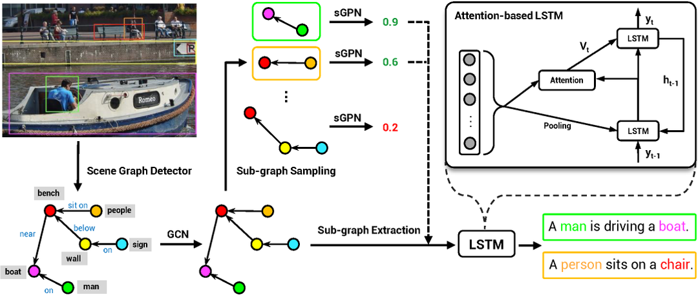

# Sub-GC

This repository includes the Pytorch code for our paper "[Comprehensive Image Captioning via Scene Graph Decomposition](https://arxiv.org/pdf/2007.11731.pdf)" in ECCV 2020.



[[Project Page]](http://pages.cs.wisc.edu/~yiwuzhong/Sub-GC.html) [[Paper]](https://arxiv.org/pdf/2007.11731.pdf)

## Dependencies
* Python 3+
* Pytorch 1.3.0+

Python and Pytorch can be installed by anaconda, run
```
conda create --name ENV_NAME python=3
source activate ENV_NAME
conda install pytorch torchvision cudatoolkit=10.1 -c pytorch
```
where `ENV_NAME` and [cudatoolkit version](https://pytorch.org/) can be specified by your own.

For the other dependencies, run `pip install -r requirements.txt` to install.

## Data

Check [DATA.md](https://github.com/YiwuZhong/Sub-GC/blob/master/DATA.md) for instructions of data downloading.

## Model Training

To train our image captioning models, run the script
```
bash train.sh MODEL_TYPE
```
by replacing `MODEL_TYPE` with one of `[Sub_GC_MRNN, Sub_GC_Kar, Full_GC_Kar, Sub_GC_Flickr, Sub_GC_Sup_Flickr]`. `MODEL_TYPE` specifies the dataset, the data split and the model used for training. See details below.

1. COCO Caption Dataset
    * `Sub_GC_MRNN`: train a sub-graph captioning model on M-RNN split (Table 2 in our paper)
    * `Sub_GC_Kar`: train a sub-graph captioning model on Karpathy split (Table 3 in our paper)
    * `Full_GC_Kar`: train a full-graph captioning model on Karpathy split (Table 3 in our paper)

2. Flickr30K Dataset
    * `Sub_GC_Flickr`: train a sub-graph captioning model (Table 4 & 5 in our paper)
    * `Sub_GC_Sup_Flickr`: train a supervised sub-graph captioning model (Table 5 in our paper)

You can set `CUDA_VISIBLE_DEVICES` in `train.sh` to specify which GPUs are used for model training (e.g., the default script uses 2 GPUs).

## Model Evaluation
The evaluation is divided into 2 steps
- The trained model is first used to generate captions
- The generated sentences are evaluated in terms of diversity, top-1 accuracy, grounding and controllability.

### Caption Generation

To generate captions, run the script
```
bash test.sh MODEL_TYPE
```
by replacing `MODEL_TYPE` with one of `[Sub_GC_MRNN, Sub_GC_S_MRNN, Sub_GC_Kar, Full_GC_Kar, Sub_GC_Flickr, Sub_GC_Flickr_GRD, Sub_GC_Flickr_CTL, Sub_GC_Sup_Flickr_CTL]`. `MODEL_TYPE` specifies the dataset, the data split and the model used for sentence generation. See details below.

1. COCO Caption Dataset
    * `Sub_GC_MRNN`: use the sub-graph captioning model (Sub-GC) on M-RNN split (Table 2 in our paper)
    * `Sub_GC_S_MRNN`: use Sub-GC with top-k sampling (Sub-GC-S) on M-RNN split (Table 2 in our paper)
    * `Sub_GC_Kar`: use the sub-graph captioning model (Sub-GC) on Karpathy split (Table 3 in our paper)
    * `Full_GC_Kar`: use the full graph captioning model (Full-GC) on Karpathy split (Table 3 in our paper)

2. Flickr30K Dataset
    * `Sub_GC_Flickr`: use Sub-GC for top-1 caption accuracy evaluation (Table 4 in our paper)
    * `Sub_GC_Flickr_GRD`: use Sub-GC for grounding evaluation (Table 4 in our paper)
    * `Sub_GC_Flickr_CTL`: use Sub-GC for controllability evaluation (Table 5 in our paper)
    * `Sub_GC_Sup_Flickr_CTL`: use Sub-GC (Sup.) for controllability evaluation (Table 5 in our paper)

The inference results will be saved in a `captions_*.npy` file at the same folder as the model checkpoint (e.g., `pretrained/sub_gc_MRNN`). `$CAPTION_FILE` will be used as the name of generated `captions_*.npy` file in the following instructions.

### Diversity Evaluation

Move the generated `$CAPTION_FILE` into folder `misc/diversity` and run
```
cd misc/diversity
python diversity_score.py --input_file $CAPTION_FILE
```
To evaluate the metric of mBLEU-4 (takes much longer time than other metrics), run
```
cd misc/diversity
python diversity_score.py --input_file $CAPTION_FILE --evaluate_mB4
```

### Top-1 Accuracy Evaluation

In our paper, we report the top-1 accuracy of the best caption selected by sGPN+consensus. To reproduce the results, move the generated `$CAPTION_FILE` into folder `misc/consensus_reranking/hypotheses_mRNN` and run:
```
cd misc/consensus_reranking
python cr_mRNN_demo.py --input_file $CAPTION_FILE --dataset coco --split MRNN --top_k 4 
```
This will apply [consensus reranking](https://github.com/mjhucla/mRNN-CR) on the top 4 captions selected by our sGPN scores as described in our paper. The arguments of `--dataset` and `--split` specify the dataset (`coco` or `flickr30k`) and the split (`MRNN` or `karpathy`), respectively.

If you want to evaluate the top-1 caption selected by our sGPN or the top-1 accuracy for Full-GC, set `--only_sent_eval` to `1` in `test.sh` and rerun the bash file. If you want to evaluate the oracle scores which will take a few hours, set `--only_sent_eval` to `1` and add `--orcle_num 1000` in `test.sh`, and rerun the bash file.

### Grounding Evaluation (on Flickr30k)
In our paper, we report the grounding scores of the best caption selected by sGPN+consensus. To reproduce the results, this section requires 3 substeps:

1. Select the best caption by consensus reranking: use our sub-graph captioning model to generate captions (`bash test.sh Sub_GC_Flickr_GRD`), and apply consensus reranking on the top generated captions (see instruction in the section of Top-1 Accuracy Evaluation). A file named `consensus_rerank_ind.npy` that contains the ranking indices will be generated at `misc/consensus_reranking`.

2. Collect the grounding results for the best caption: move `consensus_rerank_ind.npy` into the same folder of the model checkpoint (e.g., `pretrained/sub_gc_flickr`). Run `bash test.sh Sub_GC_Flickr_GRD` again and `grounding_file.json` that contains the grounding results will be generated at the same folder of the model checkpoint.

3. Evaluate the grounding results: move `grounding_file.json` into `misc/grounding` and run `cd misc/grounding; python grounding_score.py`.

This section follows the implementation from [grounding evaluation](https://github.com/facebookresearch/grounded-video-description/tree/flickr_branch), which evaluates the grounding performance without beam search. To this end, we disable beam search for the grounding evaluation.

### Controllability Evaluation (on Flickr30k)
After running `bash test.sh MODEL_TYPE` with `MODEL_TYPE` as `Sub_GC_Flickr_CTL` or `Sub_GC_Sup_Flickr_CTL`, an output file `$CTL_CAPTION_FILE` (e.g., `ctl_captions_*.npy`) will be generated and locate at the same folder as the model checkpoint (e.g., `pretrained/sub_gc_sup_flickr`). This output file stores the predicted captions which are ready for [controllability evaluation](https://github.com/aimagelab/show-control-and-tell).

To obtain the controllability scores, move that output file into folder `misc/controllability` and run
```
cd misc/controllability
python controllability_score.py --input_file $CTL_CAPTION_FILE
```

## Acknowledgement

This repository was built based on [Ruotian Luo's implementation](https://github.com/ruotianluo/self-critical.pytorch/tree/2.5) for image captioning and [Graph-RCNN](https://github.com/jwyang/graph-rcnn.pytorch). Partial evaluation protocols were implemented based on several code repositories, including: [coco-caption](https://github.com/tylin/coco-caption), [consensus reranking](https://github.com/mjhucla/mRNN-CR), [grounding evaluation](https://github.com/facebookresearch/grounded-video-description/tree/flickr_branch), and [controllability evaluation](https://github.com/aimagelab/show-control-and-tell).

## Reference
If you are using our code, please consider citing our paper.
```
@inproceedings{zhong2020comprehensive,
  title={Comprehensive Image Captioning via Scene Graph Decomposition},
  author={Zhong, Yiwu and Wang, Liwei and Chen, Jianshu and Yu, Dong and Li, Yin},
  booktitle={ECCV},
  year={2020}
}
```
